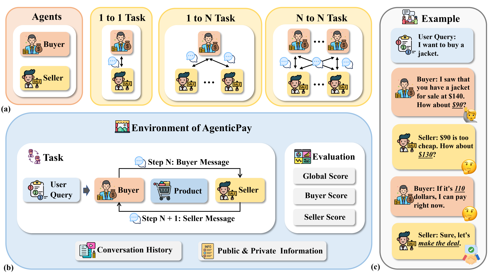
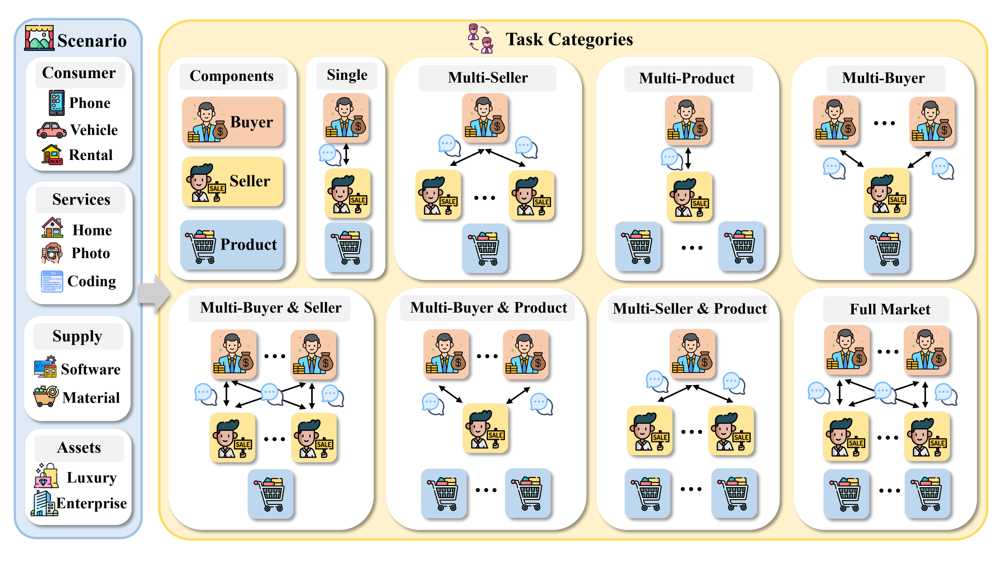

Welcome to AgenticPay's Documentation!
=======================================

**AgenticPay** is a multi-agent LLM negotiation framework for simulating buyer-seller transactions.
It provides a Gymnasium-like API for building and testing intelligent negotiation agents powered by Large Language Models.

| |arXiv| |GitHub|

.. |arXiv| image:: https://img.shields.io/badge/arXiv-2602.06008-b31b1b.svg
   :target: https://arxiv.org/abs/2602.06008

.. |GitHub| image:: https://img.shields.io/badge/GitHub-AgenticPay-blue.svg
   :target: https://github.com/SafeRL-Lab/AgenticPay

Framework Overview
------------------

   *Figure 1: AgenticPay Framework Overview*

   *Figure 2: Scenario and Task Categories*

Key Features
------------

- 🤖 **LLM-based Agents**: Buyer and Seller agents powered by LLMs (OpenAI, vLLM, SGLang)
- 💬 **Multi-turn Conversations**: Extended negotiation dialogues with context preservation
- 🧠 **Memory System**: Conversation history management for context-aware negotiations
- 📊 **State Tracking**: Comprehensive tracking of prices, rounds, and negotiation status
- 🎯 **Flexible Configuration**: Customizable negotiation parameters and agent behaviors
- 🔌 **Extensible Design**: Easy to add new agent types or LLM providers
- 🏪 **Environment Registration**: Gymnasium-like environment registration system
- 🛍️ **Multi-Product Negotiations**: Support for multiple products with context preservation
- 👥 **Multi-Agent Scenarios**: Multiple buyers, sellers, and products combinations
- 🔄 **Parallel & Sequential Modes**: Both parallel and sequential negotiation support

Quick Example
-------------

.. code-block:: python

   from agenticpay import make
   from agenticpay.agents.buyer_agent import BuyerAgent
   from agenticpay.agents.seller_agent import SellerAgent
   from agenticpay.models.sglang_lm import SGLangLM

   # Initialize model
   model = SGLangLM(model_path="path/to/your/model")

   # Create agents
   buyer = BuyerAgent(model=model, buyer_max_price=120.0)
   seller = SellerAgent(model=model, seller_min_price=80.0)

   # Create environment
   env = make(
       "Task1_basic_price_negotiation-v0",
       buyer_agent=buyer,
       seller_agent=seller,
       max_rounds=20,
       initial_seller_price=150.0,
   )

   # Run negotiation
   observation, info = env.reset(
       user_requirement="I need a winter jacket",
       product_info={"name": "Premium Winter Jacket", "price": 180.0}
   )

   done = False
   while not done:
       buyer_action = buyer.respond(observation["conversation_history"], observation)
       seller_action = seller.respond(observation["conversation_history"], observation)
       observation, reward, terminated, truncated, info = env.step(buyer_action, seller_action)
       done = terminated or truncated

.. note::

   This project is under active development.

Contents
--------

.. toctree::
   :maxdepth: 2
   :caption: Getting Started

   installation
   quickstart

.. toctree::
   :maxdepth: 2
   :caption: User Guide

   core_concepts
   environments
   agents
   configuration

.. toctree::
   :maxdepth: 2
   :caption: Examples

   examples

Indices and tables
------------------

* :ref:`genindex`
* :ref:`modindex`
* :ref:`search`
